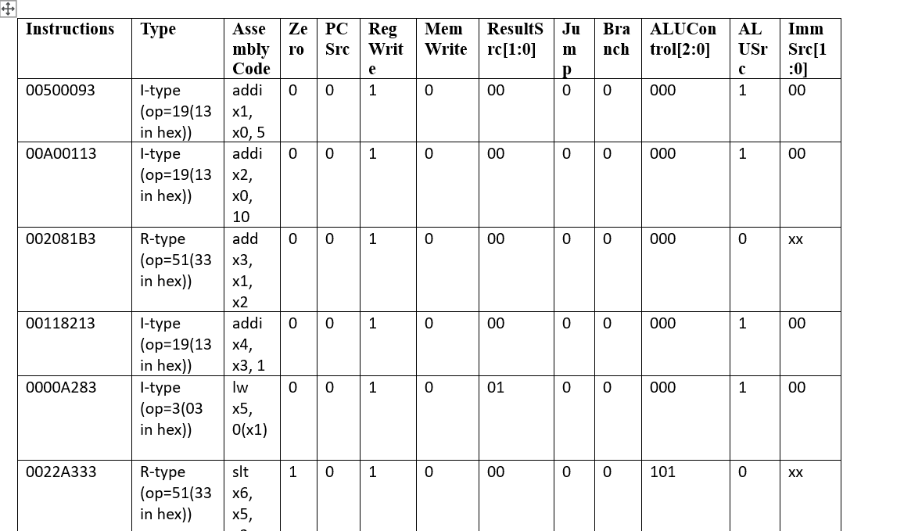

## Single-Cycle RISC-V Processor (RV32I)

📌 **Overview**  
This project implements a 32-bit Single-Cycle RISC-V processor using SystemVerilog (RV32I subset). Each instruction executes in a single clock cycle.

---

🧠 **Architecture Summary**  
The processor follows the classical single-cycle datapath (IF → ID → EX → MEM → WB).

**Block Diagram:**  

---

🧪 **Verification**  

**Control Signals Verified:**  
This image shows correct assertion of control signals for different instructions.  

**Simulation Waveform:**  
This waveform shows instruction execution, PC increment, register file updates, and ALU outputs over time.  

---

🔧 **Major Components**
- Program Counter (PC)  
- Instruction Memory  
- Register File  
- Immediate Generator  
- Control Unit & ALU Control  
- Arithmetic Logic Unit (ALU)  
- Data Memory  
- Multiplexers

---

📜 **Supported Instructions (RV32I Subset)**  
- **R-Type:** add, sub, and, or, xor, slt  
- **I-Type:** addi, andi, ori, lw  
- **S-Type:** sw  
- **B-Type:** beq, bne  
- **J-Type:** jal  

⚠️ Only a learning-focused subset.

---

👤 **Author**  
Wayna Ali – [GitHub](https://github.com/waynaali)
